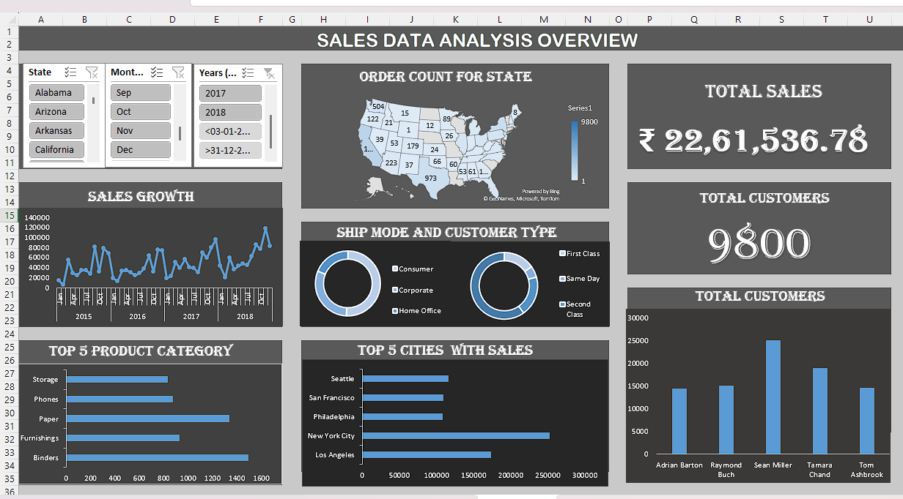

# SuperStore Sales Analysis

## Overview

The **SuperStore Sales Analysis** project provides a comprehensive analysis of sales data from a fictitious retail store. This analysis aims to uncover insights into sales performance, customer behavior, and product trends using Excel.

## Project Goals

- Analyze sales trends over time.
- Identify top-performing products and categories.
- Examine customer demographics and purchasing patterns.
- Provide actionable recommendations to improve sales performance.

## Data Description

The dataset contains the following key columns:

- **Order ID**: Unique identifier for each order.
- **Order Date**: Date when the order was placed.
- **Ship Date**: Date when the order was shipped.
- **Customer ID**: Unique identifier for each customer.
- **Segment**: Customer segment (e.g., Consumer, Corporate, Home Office).
- **Country**: Country where the order was made.
- **City**: City of the customer.
- **State**: State of the customer.
- **Product ID**: Unique identifier for each product.
- **Category**: Category of the product (e.g., Furniture, Office Supplies, Technology).
- **Sales**: Total sales amount for the order.
- **Quantity**: Quantity of items sold.
- **Discount**: Discount applied to the order.

## Features

- **Sales Dashboards**: Interactive dashboards visualizing key metrics and trends.
- **Pivot Tables**: Summarized views of sales data for quick insights.
- **Charts**: Visual representations of sales trends, customer demographics, and product performance.
- **What-If Analysis**: Scenarios to project potential outcomes based on different variables.

## Getting Started

1. Download the Excel file from the repository.
2. Open the file in Microsoft Excel or a compatible spreadsheet application.
3. Explore the dashboards and charts to analyze the data.

## Usage

This analysis is intended for business analysts, marketing teams, and decision-makers looking to enhance their understanding of sales performance and identify growth opportunities.

## Acknowledgements

- Inspired by real-world retail analytics.
- Special thanks to the open data community for providing datasets for practice.

## SuperStore Sales Analysis Dashboard 
Here’s a snapshot of our SuperStore Sales Analysis dashboard:

